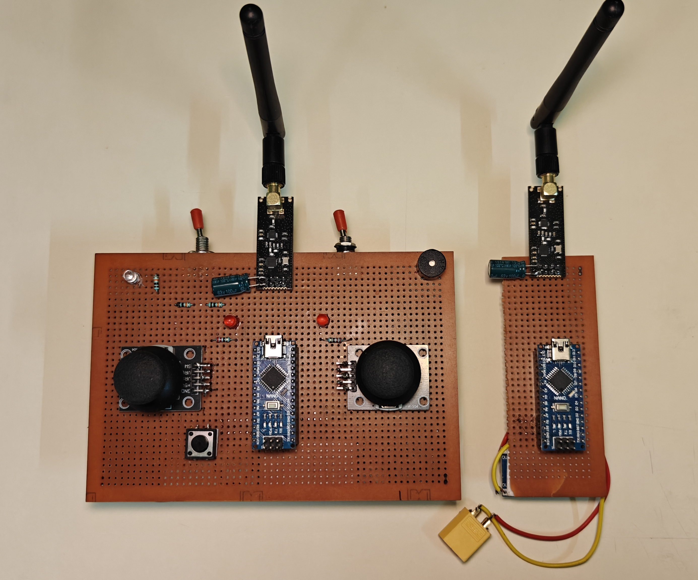
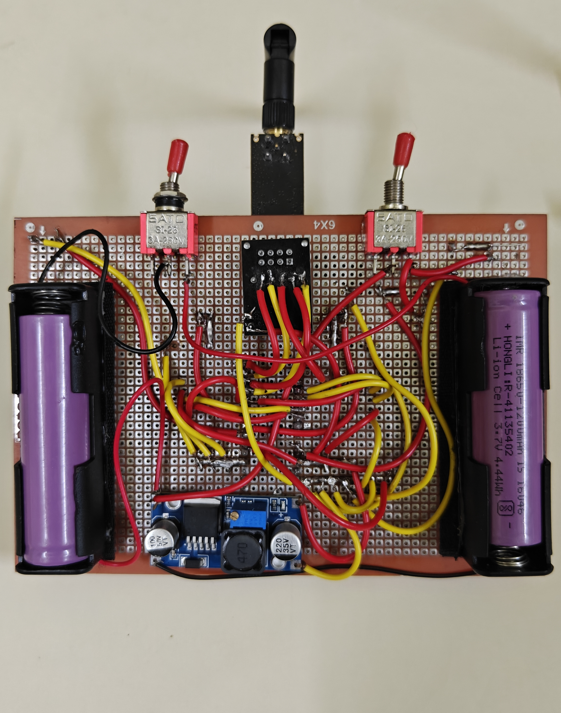
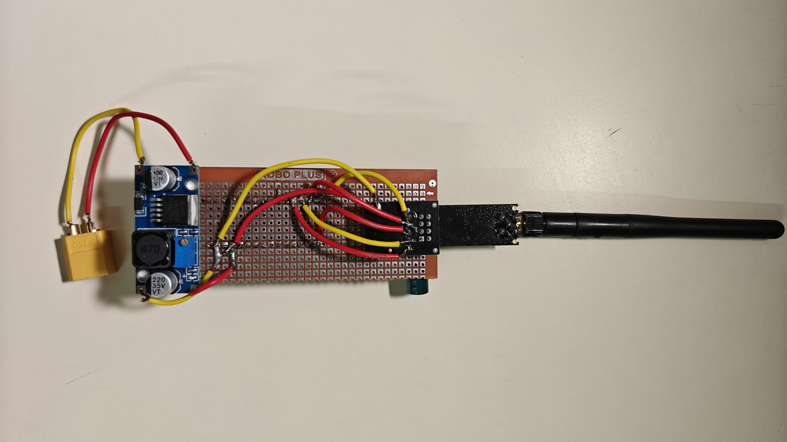

<div align="center">

# 🎮 RF Remote Controller

**A programmable handheld remote built for dual-purpose control — from flying unmanned aerial vehicles to commanding your favorite video games — powered by a long-range 2.4GHz NRF24L01+PA+LNA link.**


</div>

---

## 📖 About the Project

This is a custom-built, handheld RF remote controller consisting of a **transmitter** and **receiver**, both driven by Arduino Nano boards and linked over a long-range NRF24L01+PA+LNA 2.4GHz radio module. It's designed to be flexible — the same hardware platform that can fly a drone can just as easily become a game controller.

Right now, this build is configured to play **Beach Buggy Racing**, with the joystick controls mapped to match the game. To use it on your laptop, plug in the receiver and run the included Python script in the background — it reads the incoming transmitter data and translates it into keyboard/game inputs in real time.

> [!TIP]
> Because the transmitter and receiver logic are decoupled, this same base can be reconfigured for other games or repurposed as a flight controller remote with only firmware-level changes.

---

## ✨ Features

- 📡 **Long-range 2.4GHz link** — Built on the NRF24L01+PA+LNA module, giving 1km+ range, making it capable enough for real RC/drone applications, not just games.
- 🔋 **Battery monitoring with visual + audio alerts** — Red LEDs on both units light up when voltage drops below 6.6V, and a buzzer sounds once it falls below 6.0V, warning of a critical charge level.
- 🔌 **Dual-switch control** — One switch powers the main system (Nano on/off), and a second dedicated switch enables battery monitoring, indicated by a white LED beside it.
- ✅ **Ready-to-transmit indicator** — Flipping the main switch on triggers the transmitter's red LED to blink twice, confirming the module is live and ready to send data.
- 🎮 **Plug-and-play game control** — Connect the receiver via a USB 2.0 mini cable and run the provided Python script to map incoming transmitter data directly to in-game controls.

---

## 🛠️ Hardware Required

|Sr no. | Component | Quantity | Notes |
|---|---|---|---|
| 1 | Arduino Nano | 2 | 1 for transmitter, 1 for receiver |
| 2 | NRF24L01+PA+LNA module | 2 | Long-range variant with external antenna |
| 3 | Analog Joystick module | 2 | X/Y axis + push button |
| 4 | 3.7v Lithium ion battery | 2 | Power source for transmitter |
| 5 | Cell holder | 2 | Holds cells |
| 6 | Toggle Switch | 2 | To turn on/off transmitter and voltage reader |
| 7 | Perfboard | 2 | To place components and solder them |
| 8 | Pushbutton | 1 | Placed on transmitter |
| 9 | Buzzer | 1 | Used as an alarm on transmitter |
| 10 | White led  | 1 | Indicator that voltage reader is on |
| 11 | Red led | 2 | Turns on when battery voltage level is low |
| 12 | 100μ Capacitor | 2 | To be placed between vcc and gnd of nrf module |
| 13 | nrf adapter | 2 | powers nrf module with steady voltage required |
| 14 | 220Ω resistor | 2 | Regulates current flow to prevent damage when illuminating red LEDs. |
| 15 | 10kΩ resistor | 1 | turns on white led safely |
| 16 | lm256 buck converter | 2 | safely steps down voltage to 5v to turn on arduino nano |
| 17 | female head pins set | 2 | To place nano on both of the perfboard |

---

## 📸 Hardware Photos

<div align="center">

| Transmitter & Receiver — Front | Transmitter — Back |
|:---:|:---:|
|  |  |

| Receiver — Back |
|:---:|:---:|
|  |

</div>

> [!NOTE]
> Place your image files inside `docs/images/` in the repo, using the **exact same filenames** shown above (or update the filenames in this table to match yours). GitHub will automatically render them here — no extra steps needed once the files are pushed.

---

## 🎬 Demo

<div align="center">


</div>

> [!NOTE]
> Drop your demo GIF into `docs/images/working_demo.gif` (or update the path above) and it will auto-play right here on the repo page.

---

## 🔌 Wiring / Connections

> [!NOTE]
> Add your wiring diagram here once ready.
> ```markdown
> 
> ```

---

## 🚀 Getting Started

🧰 Before You Start Building

If you're planning to build your own version of this RC, a few tools will make the process much easier: wire bundles, a wire stripper, a soldering iron, flux, and solder wire. These aren't optional extras — they're essential to getting a reliable build.

The NRF24 module communicates with the microcontroller over the SPI protocol, which is notoriously sensitive to loose or unstable connections. Even a slightly wobbly jumper wire on the SPI lines can cause intermittent data loss, random disconnects, or a link that works on the bench but fails the moment you move it. Because of this, breadboard-only setups are not recommended for a final build — solder every connection permanently rather than relying on push-fit wires. Follow the schematic provided in this repo closely while wiring, and keep your wire runs as short as possible. Short wires aren't just neater — they reduce signal noise, minimize the chance of shorts, and keep the final enclosure compact instead of turning into a tangle of excess length.


[!TIP]
Solder your connections on a flat surface, double-check continuity with a multimeter before powering on, and route your wires along the same path as the schematic — it makes debugging far easier later if something doesn't work on first boot.

### Option 1 — Clone the Repository

```bash
git clone https://github.com/SohamKale83/Remote-Controller.git
cd Remote-Controller
```

This gives you the full project — transmitter code, receiver code, and the Python script — on your machine.

### Option 2 — Manually Copy the Code (Arduino IDE)

If you'd rather not use Git, you can copy-paste the code directly:

1. Open the [Arduino IDE](https://www.arduino.cc/en/software).
2. Open `transmitter/transmitter.ino` (or `receiver/receiver.ino`) from this repo on GitHub.
3. Click **Copy raw file**, then paste the code into a new sketch in the Arduino IDE.
4. Select the correct board and port:
   - **Tools → Board → Arduino Nano**
   - **Tools → Port → (your COM port)**
5. Click **Upload** ⬆️.
6. Repeat for the second unit with the corresponding code.

> [!WARNING]
> Make sure you flash the **transmitter code onto the transmitter's Nano** and the **receiver code onto the receiver's Nano** — flashing the wrong sketch onto either board will prevent the link from working.

---

## 🎮 How to Use

1. Power on both the transmitter and receiver using the main switch.
2. Watch for the transmitter's red LED to blink **twice** — this confirms it's ready to transmit.
3. (Optional) Flip the second switch to enable battery monitoring — the white LED beside it turns on.
4. Connect the receiver to your laptop using a **USB 2.0 mini cable**.
5. Run the provided Python script in the background to map transmitter input to game controls.
6. Launch **Beach Buggy Racing** and start playing using the joysticks.

> [!CAUTION]
> If the red LEDs turn on during use, battery voltage has dropped below 6.6V. If the buzzer sounds, voltage is below 6.0V — recharge immediately to avoid over-discharging the battery.

---

## 📁 Repository Structure

```
Remote-Controller/
├── docs/
│   └── images/
├── transmitter/
│   └── transmitter.ino
├── receiver/
│   └── receiver.ino
├── scripts/
│   └── game_control.py
├── hardware/
│   └── bom.md
├── README.md
└── LICENSE
```

## 📄 License

This project is licensed under the MIT License — see the [LICENSE](LICENSE) file for details.

## 👤 Author

**Soham Kale**
GitHub: [@SohamKale83](https://github.com/SohamKale83)